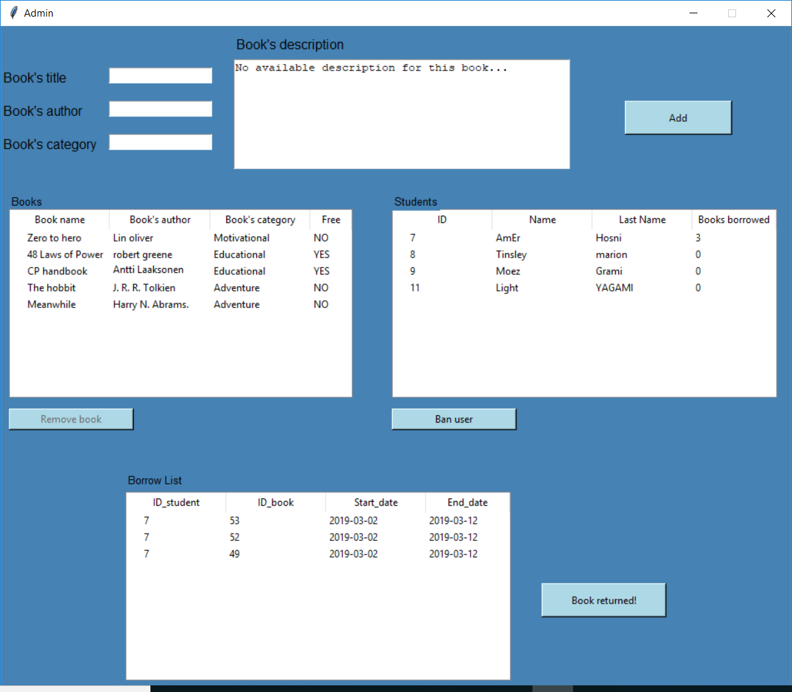
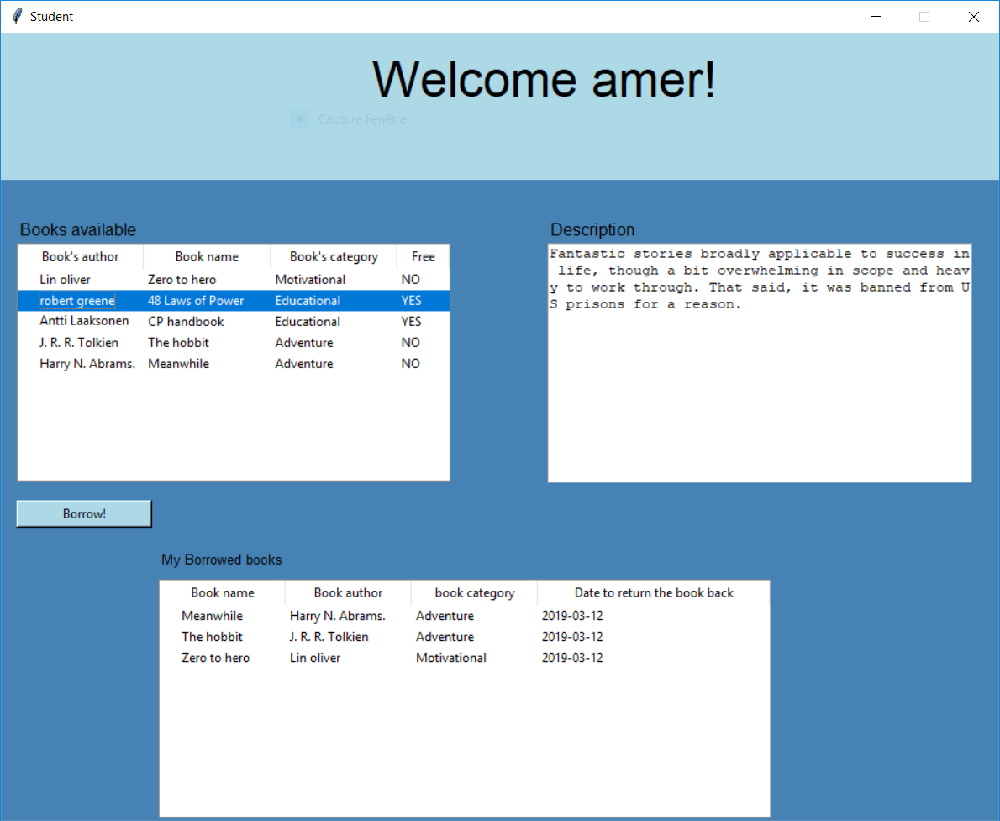

# Library Manager
Python starting project for a library manager, developed using:
  - Python3/Tkinter
  - SQLite3 as RDBMS
## Authentification: Admin and Student
Start your local copy of the application using the following command on the Command Line Tool
```sh
$ python auth.py
```

In the main application you have two interfaces
### Admin interface

### Student/User interface

